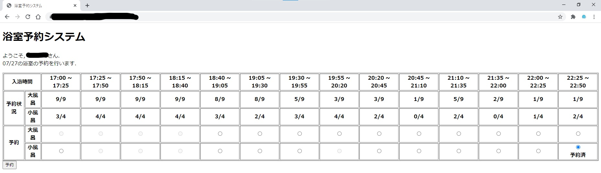

# 香川高専詫間キャンパス学生寮浴室予約システム
<div align="center">

</div>

本システムは香川高専詫間キャンパスの学生寮における，浴室での三密回避を目的に開発しています．  


## 動作画面

現在の男子寮生の予約画面です．  
25分刻みで予約枠があります．

## 動作環境
+ サーバー
    + Microsoft Azure® App Servise  
    Python(Flask)を用いたWebアプリです．
+ データベース
    + Microsoft Azure® SQL データベース

Azure上ではなく，私有のサーバー等で運用される際は，requirements.txtに記載されたPythonパッケージを以下のコマンドでインストールしてください．
```shell
pip install -r requirements.txt
```

## 使用方法
対応し次第追記いたします．

## 開発者
+ [山地 駿徹](https://github.com/Yamaji-Toshiyuki)   
    + メールアドレス : [e16278@kagawa.kosen-ac.jp](mailto:e16278@kagawa.kosen-ac.jp)
    + Twitter : [@haruyuki_16278](https://twitter.com/haruyuki_16278)